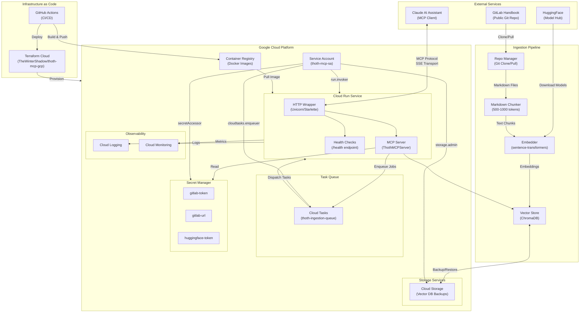
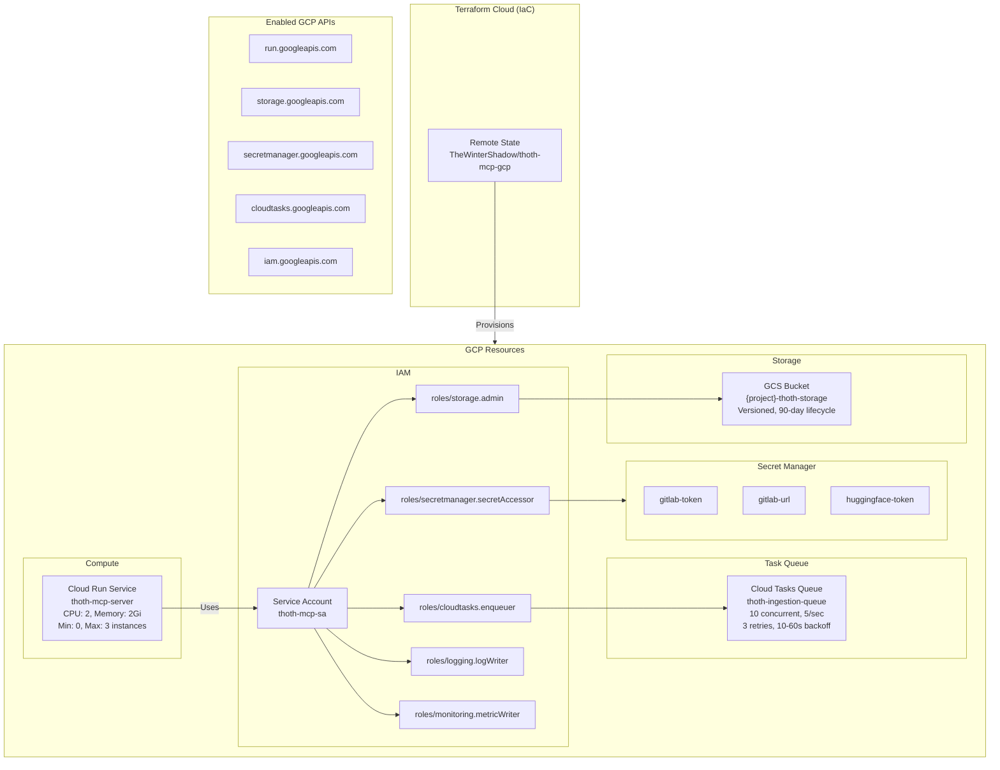
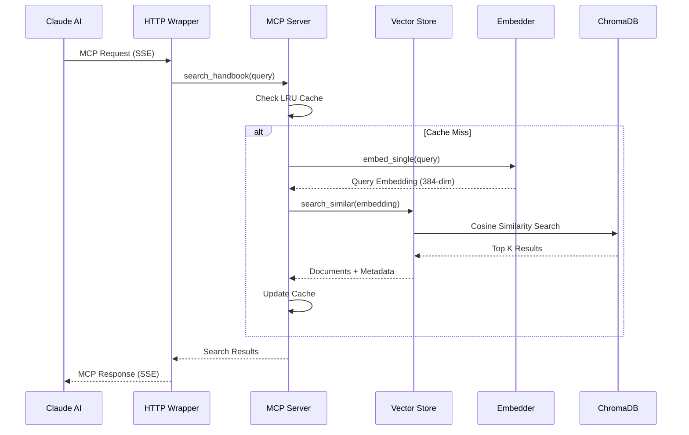
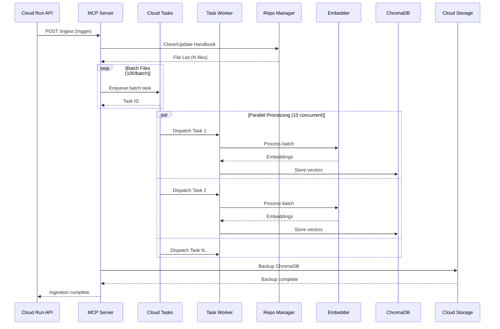

# Thoth

[](https://badge.fury.io/py/thoth)
[](https://pypi.org/project/thoth/)
[](https://github.com/TheWinterShadow/Thoth/actions)
[](https://codecov.io/gh/TheWinterShadow/Thoth)
[](https://opensource.org/licenses/MIT)

Thoth is a modern Python library providing advanced utilities and tools for developers. Named after the ancient Egyptian god of wisdom and writing, Thoth aims to bring clarity and structure to your Python projects through well-designed, modular utilities.

## 🚀 Features

- **Repository Management**: Clone and track GitLab handbook repository with automated updates
- **Vector Database**: ChromaDB integration for storing and querying document embeddings with semantic search
- **Cloud Storage**: Google Cloud Storage integration for vector DB persistence and backup
- **Embedding Generation**: Efficient batch embedding generation using sentence-transformers models
- **Cloud Deployment**: Ready-to-deploy to Google Cloud Run with automated deployment scripts
- **MCP Server**: Model Context Protocol server for AI assistant integration
- **Modular Design**: Clean, composable utility functions
- **Type Safety**: Full type annotations with mypy support
- **High Performance**: Optimized implementations for common tasks
- **Easy Integration**: Minimal dependencies with optional extensions
- **Well Documented**: Comprehensive documentation and examples
- **Thoroughly Tested**: Extensive test coverage with automated CI/CD

## 📦 Installation

### From PyPI (Recommended)

```bash
pip install thoth
```

### CPU-Only Installation (Faster, Smaller)

For CPU-only PyTorch (recommended for most use cases):

```bash
pip install torch --index-url https://download.pytorch.org/whl/cpu
pip install thoth
```

### Development Installation

```bash
git clone https://github.com/TheWinterShadow/Thoth.git
cd Thoth
pip install -e ".[dev]"
```

## 🏃‍♂️ Quick Start

### Repository Management

```python
from thoth.ingestion.repo_manager import HandbookRepoManager

# Initialize the repository manager
manager = HandbookRepoManager()

# Clone the GitLab handbook repository
repo_path = manager.clone_handbook()
print(f"Repository cloned to: {repo_path}")

# Get current commit and save metadata
commit_sha = manager.get_current_commit()
manager.save_metadata(commit_sha)

# Update repository and check for changes
manager.update_repository()
metadata = manager.load_metadata()
if metadata:
    changed_files = manager.get_changed_files(metadata["commit_sha"])
    print(f"Changed files: {changed_files}")
```

### Vector Store

```python
from thoth.shared.vector_store import VectorStore

# Initialize the vector store (uses all-MiniLM-L6-v2 by default)
vector_store = VectorStore(
    persist_directory="./chroma_db",
    collection_name="handbook_docs"
)

# Initialize with Google Cloud Storage backup (optional)
vector_store_with_gcs = VectorStore(
    persist_directory="./chroma_db",
    collection_name="handbook_docs",
    gcs_bucket_name="thoth-storage-bucket",
    gcs_project_id="thoth-dev-485501"
)

# Add documents - embeddings are automatically generated
documents = [
    "Python is a high-level programming language.",
    "JavaScript is used for web development.",
    "Machine learning is a subset of AI."
]
vector_store.add_documents(documents)

# Search for similar documents using semantic similarity
results = vector_store.search_similar(
    query="programming languages",
    n_results=2
)
print(results["documents"])

# Backup to Google Cloud Storage
backup_name = vector_store_with_gcs.backup_to_gcs()
print(f"Backup created: {backup_name}")

# Restore from backup
vector_store_with_gcs.restore_from_gcs(backup_name="backup_20260112_120000")

# Add documents with metadata for filtering
vector_store.add_documents(
    documents=["Python tutorial", "Advanced Python"],
    metadatas=[
        {"language": "python", "level": "beginner"},
        {"language": "python", "level": "advanced"}
    ]
)

# Search with filters
results = vector_store.search_similar(
    query="Python guide",
    where={"level": "beginner"}
)
```

### Embedding Generation

```python
from thoth.shared.embedder import Embedder

# Initialize embedder with default model (all-MiniLM-L6-v2)
embedder = Embedder()

# Generate embeddings for texts
texts = ["Document 1", "Document 2", "Document 3"]
embeddings = embedder.embed(texts, show_progress=True)

# Generate single embedding
embedding = embedder.embed_single("Single document")

# Get model information
info = embedder.get_model_info()
print(f"Embedding dimension: {info['embedding_dimension']}")

# Use alternative model for higher quality
high_quality_embedder = Embedder(model_name="all-mpnet-base-v2")
embeddings = high_quality_embedder.embed(texts)
```

### MCP Server

```python
import asyncio
from thoth.mcp.server import ThothMCPServer

# Create and run the MCP server
async def main():
    server = ThothMCPServer(
        name="my-handbook-server",
        version="1.0.0"
    )
    await server.run()

asyncio.run(main())
```

## 🏗️ Project Architecture

Thoth follows a modular architecture designed for extensibility and maintainability.

### System Architecture Diagram



### Data Flow Diagram

```mermaid
flowchart LR
    subgraph Ingestion["Data Ingestion Flow"]
        direction TB
        A1["1. Clone/Update<br/>GitLab Handbook"]
        A2["2. Discover<br/>Markdown Files"]
        A3["3. Load Pipeline State<br/>(Resume Support)"]
        A4["4. Chunk Documents<br/>(500-1000 tokens)"]
        A5["5. Generate Embeddings<br/>(all-MiniLM-L6-v2)"]
        A6["6. Store in ChromaDB<br/>(Vector Database)"]
        A7["7. Backup to GCS<br/>(Optional)"]

        A1 --> A2 --> A3 --> A4 --> A5 --> A6 --> A7
    end

    subgraph Query["Query Flow"]
        direction TB
        B1["1. User Query<br/>(Natural Language)"]
        B2["2. Check LRU Cache<br/>(100 entries)"]
        B3["3. Generate Query<br/>Embedding"]
        B4["4. Vector Similarity<br/>Search (Cosine)"]
        B5["5. Return Results<br/>+ Metadata"]

        B1 --> B2 --> B3 --> B4 --> B5
    end

    subgraph Parallel["Parallel Ingestion Flow (Cloud Tasks)"]
        direction TB
        C1["1. Trigger Ingestion<br/>(API or Schedule)"]
        C2["2. Enqueue File Batches<br/>(100 files/batch)"]
        C3["3. Cloud Tasks Dispatch<br/>(10 concurrent, 5/sec)"]
        C4["4. Parallel Processing<br/>(Chunk + Embed)"]
        C5["5. Merge Results<br/>to ChromaDB"]

        C1 --> C2 --> C3 --> C4 --> C5
    end
```



### GCP Infrastructure Diagram



### Component Interaction Diagram



### Parallel Ingestion Sequence



### Directory Structure

```
thoth/                              # Main application package
├── __init__.py                     # Package entry point
├── __about__.py                    # Version and metadata
├── ingestion/                      # Data ingestion pipeline
│   ├── pipeline.py                 # Main ingestion orchestrator
│   ├── chunker.py                  # Markdown document chunker
│   ├── gitlab_api.py               # GitLab API client
│   ├── repo_manager.py             # GitLab handbook repository manager
│   ├── worker.py                   # Task worker for parallel processing
│   └── gcs_repo_sync.py            # GCS sync for repository data
├── mcp/                            # Model Context Protocol server
│   ├── http_wrapper.py             # HTTP/SSE wrapper for Cloud Run
│   └── server/                     # MCP server implementation
│       ├── server.py               # ThothMCPServer with search tools
│       └── plugins/                # Tool and RAG plugins
└── shared/                         # Shared utilities and services
    ├── cli.py                      # CLI commands (ingest, search, schedule)
    ├── embedder.py                 # Embedding generation (sentence-transformers)
    ├── gcs_sync.py                 # GCS sync for vector DB backup
    ├── health.py                   # Health check for Cloud Run
    ├── monitoring.py               # Metrics and health monitoring
    ├── scheduler.py                # APScheduler for automated syncs
    ├── vector_store.py             # ChromaDB vector database wrapper
    └── utils/                      # Utility modules
        ├── logger.py               # Logging utilities
        └── secrets.py              # Secret management

terraform/                          # Infrastructure as Code (Terraform)
├── main.tf                         # Provider config, Terraform Cloud backend
├── cloud_run.tf                    # Cloud Run service definition
├── cloud_tasks.tf                  # Cloud Tasks queue for parallel ingestion
├── iam.tf                          # Service account, IAM roles, secrets, storage
├── variables.tf                    # Input variables
└── outputs.tf                      # Output values

.github/workflows/                  # CI/CD Pipelines
├── infra-deploy.yml                # Build, Terraform, deploy to Cloud Run
├── ci.yml                          # Tests on pull requests
└── cd.yml                          # PyPI publishing on releases
```

For detailed information about the project structure and design decisions, see the [Architecture Guide](https://thewintershadow.github.io/Thoth/ARCHITECTURE.html).

## 🛠️ Development

Interested in contributing? See the [Development Guide](https://thewintershadow.github.io/Thoth/DEVELOPMENT.html) for information on:

- Setting up the development environment
- Code style guidelines
- Testing procedures
- Release workflow

Also check out our [Contributing Guide](CONTRIBUTING.md) for guidelines on submitting pull requests.

## ☁️ Cloud Deployment

Thoth can be deployed to Google Cloud Run for scalable, serverless operation:

```bash
# Quick deployment
./scripts/deploy_cloud_run.sh

# Verify deployment
./scripts/verify_deployment.sh
```

For detailed deployment instructions, see:
- [Cloud Run Deployment Guide](docs/CLOUD_RUN_DEPLOYMENT.md)
- [Environment Configuration](docs/ENVIRONMENT_CONFIG.md)
- [GitHub Actions CI/CD Setup](docs/GITHUB_ACTIONS.md)

Key features:
- Automated deployment with Terraform or gcloud CLI
- GitHub Actions workflows for CI/CD
- Google Cloud Storage integration for vector DB persistence
- Auto-scaling from 0 to 10 instances
- Built-in health checks and monitoring
- Secure service account with minimal permissions

### CI/CD with GitHub Actions

The repository includes automated workflows for continuous integration and deployment:

- **Infrastructure & Cloud Run Deploy**: Automatically provisions GCP infrastructure and deploys to Cloud Run on push to main
- **Continuous Delivery**: Publishes to PyPI and deploys infrastructure on releases
- **CI**: Runs tests and quality checks on all pull requests
- **Documentation**: Builds and deploys Sphinx documentation
- **Security**: CodeQL static analysis for vulnerability detection

See [GitHub Actions Setup Guide](docs/GITHUB_ACTIONS.md) for detailed configuration and usage.

## 📖 Documentation

### Online Documentation
- **[Full Documentation](https://thewintershadow.github.io/Thoth/)** - Complete API docs and guides
- **[API Reference](https://thewintershadow.github.io/Thoth/api/modules.html)** - Auto-generated API documentation
- **[Architecture Guide](https://thewintershadow.github.io/Thoth/ARCHITECTURE.html)** - System design and structure
- **[Development Guide](https://thewintershadow.github.io/Thoth/DEVELOPMENT.html)** - Contributing and development workflow
- **[MCP Tools](https://thewintershadow.github.io/Thoth/MCP_TOOLS.html)** - Model Context Protocol tools reference
- **[Test Coverage](https://thewintershadow.github.io/Thoth/TEST_COVERAGE.html)** - Testing strategy and coverage
- **[Coverage Report](https://thewintershadow.github.io/Thoth/coverage/index.html)** - Live test coverage report

### Local Documentation
Build and view documentation locally:

```bash
# Build documentation
hatch run docs:build

# View documentation
open docs/build/index.html
```

For a complete documentation index, see [docs/README.md](docs/README.md).

## 🐛 Issues and Feature Requests

Found a bug or have a feature request? Please check the [issue tracker](https://github.com/TheWinterShadow/Thoth/issues) and create a new issue if needed.

## 📝 License

This project is licensed under the MIT License - see the [LICENSE](LICENSE) file for details.

## 🙏 Acknowledgments

- Named after Thoth, the ancient Egyptian deity of wisdom, writing, and judgment
- Inspired by the Python community's commitment to readable, maintainable code
- Built with modern Python development practices in mind

---

**Thoth** - *Bringing wisdom to your Python code*
