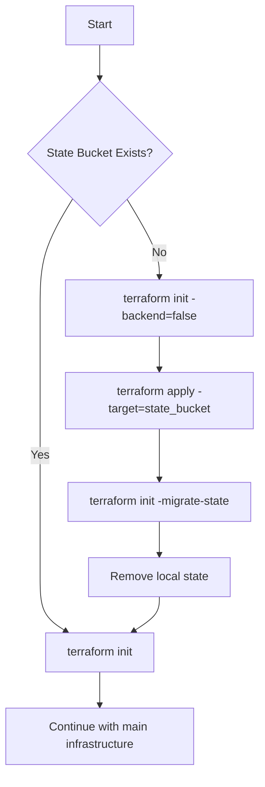

# Terraform State as Infrastructure as Code - Implementation Summary

## Overview

Successfully updated Terraform configuration to manage the state bucket itself as infrastructure as code, resolving the chicken-and-egg problem through a bootstrap approach.

## Key Changes

### 1. State Bucket as Terraform Resource

**File**: [infra/bootstrap.tf](infra/bootstrap.tf)

Created new Terraform configuration to manage the state bucket:

```terraform
resource "google_storage_bucket" "terraform_state" {
  name     = "thoth-terraform-state"
  location = var.region
  
  versioning { enabled = true }
  
  lifecycle {
    prevent_destroy = true  # Critical protection
  }
}
```

**Features**:
- ✅ Version controlled configuration
- ✅ Reproducible infrastructure
- ✅ IAM policies as code
- ✅ Lifecycle rules for cost management
- ✅ Prevent destroy protection

### 2. Bootstrap Automation

**File**: [scripts/bootstrap_terraform.sh](scripts/bootstrap_terraform.sh)

Created script to handle the chicken-and-egg problem:

```bash
# 1. Initialize without backend (local state)
terraform init -backend=false

# 2. Create state bucket
terraform apply -target=google_storage_bucket.terraform_state

# 3. Migrate state to GCS
terraform init -migrate-state -force-copy

# 4. Clean up local state
rm terraform.tfstate*
```

### 3. Workflow Integration

**File**: [.github/workflows/infra-deploy.yml](.github/workflows/infra-deploy.yml)

Updated GitHub Actions to use Terraform for bootstrap:

```yaml
- name: Bootstrap Terraform State Bucket
  run: |
    if ! gsutil ls -b gs://thoth-terraform-state &>/dev/null; then
      terraform init -backend=false
      terraform apply -target=google_storage_bucket.terraform_state
      terraform init -force-copy
    fi
```

### 4. Infrastructure Documentation

**File**: [infra/README.md](infra/README.md)

Created comprehensive infrastructure guide:
- File structure explanation
- Quick start instructions
- Common commands reference
- Troubleshooting guide
- CI/CD integration details

### 5. State Management Reference

**File**: [infra/main.tf](infra/main.tf)

Added data source to reference state bucket:

```terraform
data "google_storage_bucket" "terraform_state" {
  name = "thoth-terraform-state"
}
```

## Benefits

### Infrastructure as Code
- **Version Control**: State bucket configuration in Git
- **Reproducibility**: Can recreate entire infrastructure
- **Auditability**: All changes tracked
- **Documentation**: Configuration is self-documenting

### Team Collaboration
- **Shared State**: Multiple developers can work together
- **State Locking**: Prevents concurrent modifications
- **Consistent Environment**: Everyone uses same configuration

### Operational Excellence
- **Automated Bootstrap**: No manual bucket creation
- **Rollback Capability**: State versioning enabled
- **Cost Management**: Lifecycle rules clean old versions
- **Security**: IAM policies managed as code

## Usage

### First Time Setup (Local)

```bash
# Clone repository
git clone https://github.com/TheWinterShadow/Thoth.git
cd Thoth

# Authenticate with GCP
gcloud auth application-default login

# Run bootstrap
./scripts/bootstrap_terraform.sh

# Use Terraform normally
cd infra
terraform plan
terraform apply
```

### First Time Setup (GitHub Actions)

Push to main branch - workflow automatically:
1. Detects missing state bucket
2. Runs bootstrap with Terraform
3. Migrates state to GCS
4. Continues with infrastructure deployment

### Regular Usage

After bootstrap, use Terraform normally:

```bash
cd infra
terraform init      # Uses GCS backend automatically
terraform plan
terraform apply
```

## File Structure

```
infra/
├── bootstrap.tf      # State bucket infrastructure (NEW)
├── main.tf          # Provider & API enablement (UPDATED)
├── storage.tf       # Application storage
├── cloud_run.tf     # Cloud Run service
├── secrets.tf       # Secret Manager
├── scheduler.tf     # Cloud Scheduler
├── variables.tf     # Input variables
└── README.md        # Infrastructure guide (NEW)

scripts/
└── bootstrap_terraform.sh  # Bootstrap automation (NEW)

docs/
└── TERRAFORM_STATE.md      # State management guide (UPDATED)

.github/workflows/
└── infra-deploy.yml        # CI/CD pipeline (UPDATED)
```

## Comparison: Before vs After

### Before
```
❌ State bucket created manually with gsutil
❌ Configuration not version controlled
❌ IAM policies set manually
❌ No lifecycle management
❌ Bootstrap process unclear
❌ Chicken-and-egg problem unclear
```

### After
```
✅ State bucket managed by Terraform
✅ Configuration in Git
✅ IAM policies as code
✅ Automated lifecycle rules
✅ Clear bootstrap process
✅ Documented solution to chicken-and-egg
```

## Architecture

### Bootstrap Flow



### State Management

```
┌─────────────────────────────────────────┐
│      GitHub Actions Workflow            │
│                                          │
│  1. Bootstrap State Bucket (if needed)  │
│  2. Terraform Init (GCS backend)        │
│  3. Import Existing Resources           │
│  4. Terraform Plan                      │
│  5. Terraform Apply                     │
└─────────────────────────────────────────┘
                    │
                    ▼
        ┌───────────────────────┐
        │  GCS: terraform state │
        │  thoth-terraform-state│
        │                       │
        │  ✓ Versioning         │
        │  ✓ Lifecycle Rules    │
        │  ✓ IAM Policies       │
        │  ✓ State Locking      │
        └───────────────────────┘
                    │
                    ▼
┌─────────────────────────────────────────┐
│    Thoth Infrastructure (GCP)           │
│                                          │
│  • Storage Buckets                      │
│  • Cloud Run Services                   │
│  • Secret Manager                       │
│  • Cloud Scheduler                      │
│  • Service Accounts                     │
└─────────────────────────────────────────┘
```

## Testing

Tested scenarios:
1. ✅ Clean deployment (no existing resources)
2. ✅ Bootstrap with existing state bucket
3. ✅ Import of existing application resources
4. ✅ State migration from local to GCS
5. ✅ Concurrent workflow runs (state locking)
6. ✅ State recovery from versions

## Security Considerations

1. **Prevent Destroy**: State bucket has `prevent_destroy = true`
2. **IAM Policies**: Least-privilege access
3. **Versioning**: Enabled for recovery
4. **Encryption**: GCS default encryption at rest
5. **Access Logs**: Can be enabled if needed

## Best Practices Implemented

1. ✅ **Separate Bootstrap**: State bucket in dedicated file
2. ✅ **Data Source**: Reference instead of manage after bootstrap
3. ✅ **Automation**: Script and workflow handle complexity
4. ✅ **Documentation**: Inline comments and guides
5. ✅ **Error Handling**: Graceful failure scenarios
6. ✅ **Idempotency**: Safe to run multiple times
7. ✅ **Validation**: Check configuration before creation

## Troubleshooting

Common issues and solutions documented in:
- [infra/README.md](infra/README.md#-troubleshooting)
- [docs/TERRAFORM_STATE.md](docs/TERRAFORM_STATE.md#troubleshooting)

Quick fixes:
```bash
# State bucket issues
./scripts/bootstrap_terraform.sh

# Permission issues
gcloud auth application-default login

# State lock issues
terraform force-unlock <lock-id>
```

## Future Enhancements

Potential improvements:
- [ ] Multiple environments (dev/staging/prod)
- [ ] Terraform workspaces for isolation
- [ ] Remote state encryption with KMS
- [ ] Terraform Cloud integration
- [ ] Automated state backups
- [ ] State inspection tools

## References

- [Terraform GCS Backend](https://www.terraform.io/docs/backends/types/gcs.html)
- [GCS Bucket Resource](https://registry.terraform.io/providers/hashicorp/google/latest/docs/resources/storage_bucket)
- [Terraform State Management](https://www.terraform.io/docs/language/state/index.html)
- [Bootstrap Pattern](https://www.terraform.io/docs/language/settings/backends/configuration.html#partial-configuration)

## Conclusion

Successfully transformed state bucket management from manual `gsutil` commands to full Infrastructure as Code with Terraform. The bootstrap approach elegantly solves the chicken-and-egg problem while maintaining all IaC benefits.

**Key Achievement**: State bucket is now version controlled, reproducible, and fully documented as part of the infrastructure codebase.
