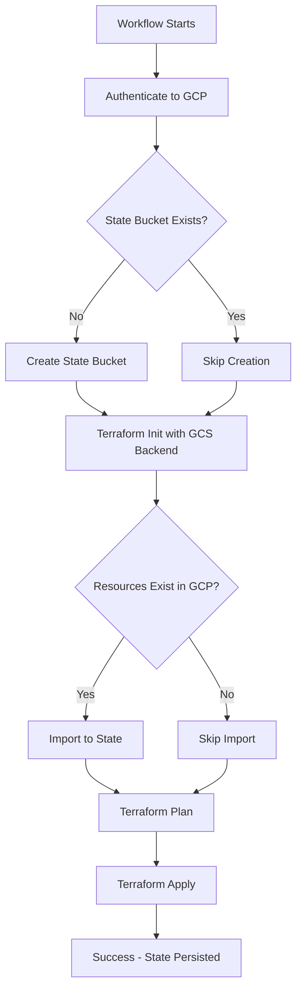

# Terraform State Management Fix

## Problem

Terraform deployments were failing with error 409 conflicts:

```
Error: googleapi: Error 409: Your previous request to create the named bucket succeeded and you already own it., conflict
```

**Root Cause**: Terraform state was stored locally and not persisted between GitHub Actions workflow runs. Each deployment started with an empty state, attempting to recreate resources that already existed in GCP.

## Solution

Implemented comprehensive Terraform state management with Infrastructure as Code approach:

### 1. State Bucket as Code ([infra/bootstrap.tf](infra/bootstrap.tf))

**NEW**: The state bucket itself is now managed by Terraform:

```terraform
resource "google_storage_bucket" "terraform_state" {
  name     = "thoth-terraform-state"
  location = var.region
  
  versioning {
    enabled = true
  }
  
  lifecycle {
    prevent_destroy = true
  }
}
```

**Benefits**:
- State bucket configuration is version controlled
- Infrastructure is fully reproducible
- Auditable changes to state bucket
- IAM policies managed as code

### 2. Remote State Storage ([infra/main.tf](infra/main.tf))

```terraform
backend "gcs" {
  bucket = "thoth-terraform-state"
  prefix = "terraform/state"
}

# Reference to state bucket (after bootstrap)
data "google_storage_bucket" "terraform_state" {
  name = "thoth-terraform-state"
}
```

**Benefits**:
- State persists between workflow runs
- Enables state locking to prevent concurrent modifications
- Automatic versioning for rollback capability
- Team collaboration with shared state

### 3. Bootstrap Script ([scripts/bootstrap_terraform.sh](scripts/bootstrap_terraform.sh))

Created automated bootstrap script for local development:

```bash
./scripts/bootstrap_terraform.sh
```

The script:
1. Initializes Terraform without backend (local state)
2. Creates state bucket using Terraform
3. Migrates state to GCS backend
4. Cleans up local state files

### 4. Workflow Automation ([.github/workflows/infra-deploy.yml](.github/workflows/infra-deploy.yml))

Updated workflow to use Terraform for bootstrap:

```bash
# Check if state bucket exists
if ! gsutil ls -b gs://thoth-terraform-state &>/dev/null; then
  # Initialize without backend
  terraform init -backend=false
  
  # Apply bootstrap configuration
  terraform apply -target=google_storage_bucket.terraform_state
  
  # Migrate to GCS backend
  terraform init -force-copy
fi
```

### 5. Existing Resource Import ([.github/workflows/infra-deploy.yml](.github/workflows/infra-deploy.yml))

Added automatic import of existing resources before planning:

```bash
if gsutil ls -b gs://thoth-storage-bucket &>/dev/null; then
  if ! terraform state show google_storage_bucket.thoth_bucket &>/dev/null; then
    terraform import google_storage_bucket.thoth_bucket thoth-storage-bucket
  fi
fi
```

### 6. Lifecycle Protection ([infra/storage.tf](infra/storage.tf))

Added lifecycle block to prevent accidental recreation:

```terraform
lifecycle {
  prevent_destroy = false
  ignore_changes = [
    name,  # Don't recreate if name hasn't changed
  ]
}
```

## Changes Made

### New Files

1. **[infra/bootstrap.tf](infra/bootstrap.tf)** - State bucket infrastructure as code
   - Creates `thoth-terraform-state` bucket
   - Configures versioning and lifecycle rules
   - Sets up IAM permissions
   - Includes lifecycle protection

2. **[scripts/bootstrap_terraform.sh](scripts/bootstrap_terraform.sh)** - Bootstrap automation
   - Authenticates with GCP
   - Runs Terraform bootstrap
   - Migrates state to GCS
   - Validates configuration

3. **[infra/README.md](infra/README.md)** - Infrastructure documentation
   - File structure explanation
   - Quick start guide
   - Common commands
   - Troubleshooting tips

### Modified Files

1. **[infra/main.tf](infra/main.tf)**
   - Added GCS backend configuration
   - Added data source for state bucket
   - State bucket: `thoth-terraform-state`

2. **[infra/storage.tf](infra/storage.tf)**
   - Added lifecycle block with `ignore_changes` for name
   - Prevents recreation of existing bucket

3. **[.github/workflows/infra-deploy.yml](.github/workflows/infra-deploy.yml)**
   - Updated to use Terraform for state bucket creation
   - Added bootstrap step with targeted apply
   - Added automatic state migration
   - Added import step for existing resources

4. **[docs/TERRAFORM_STATE.md](docs/TERRAFORM_STATE.md)** - Comprehensive state management guide:
   - State bucket as code explanation
   - Bootstrap procedures
   - State commands
   - Import procedures
   - Troubleshooting
   - Best practices

3. **[.github/workflows/infra-deploy.yml](.github/workflows/infra-deploy.yml)**
   - Added "Create Terraform State Bucket" step
   - Added "Import Existing Resources" step
   - Both steps before Terraform init/plan

### New Documentation

4. **[docs/TERRAFORM_STATE.md](docs/TERRAFORM_STATE.md)** - Comprehensive state management guide:
   - Backend configuration
   - State commands
   - Import procedures
   - Troubleshooting
   - Best practices

5. **[docs/README.md](docs/README.md)** - Added link to state management docs

6. **[docs/GITHUB_ACTIONS.md](docs/GITHUB_ACTIONS.md)** - Updated with state management info

## Deployment Flow



## Benefits

1. **No More Conflicts** - Resources are tracked in persistent state
2. **Idempotent Deployments** - Safe to run multiple times
3. **State Locking** - Prevents concurrent modifications
4. **Rollback Capability** - State versioning enabled
5. **Team Collaboration** - Shared state in GCS
6. **Automatic Recovery** - Import existing resources automatically

## Testing

The fix handles three scenarios:

1. **Clean Deployment** (no existing resources)
   - Creates state bucket
   - Creates all resources
   - Stores state in GCS

2. **Existing Resources** (first Terraform run with existing infrastructure)
   - Creates state bucket
   - Imports existing resources
   - Updates state without recreation

3. **Subsequent Deployments** (state already exists)
   - Uses existing state
   - Applies only necessary changes
   - No conflicts

## Manual Recovery (if needed)

If you encounter state issues during local development:

```bash
cd infra

# Import existing bucket
terraform import google_storage_bucket.thoth_bucket thoth-storage-bucket

# Import secrets (if needed)
terraform import google_secret_manager_secret.gitlab_token projects/thoth-483015/secrets/gitlab-token
terraform import google_secret_manager_secret.gitlab_url projects/thoth-483015/secrets/gitlab-url

# Verify state
terraform state list
```

## Next Steps

1. ✅ State bucket will be created automatically on next deployment
2. ✅ Existing resources will be imported automatically
3. ✅ Future deployments will use persistent state
4. ✅ No manual intervention required

## Related Documentation

- [TERRAFORM_STATE.md](docs/TERRAFORM_STATE.md) - Detailed state management guide
- [GITHUB_ACTIONS.md](docs/GITHUB_ACTIONS.md) - CI/CD workflow documentation
- [Terraform GCS Backend Docs](https://www.terraform.io/docs/backends/types/gcs.html)
