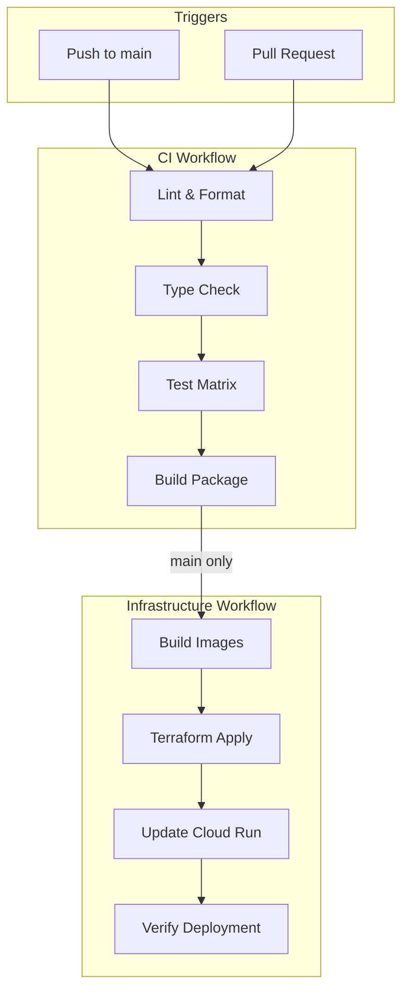
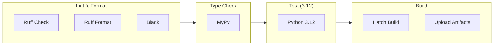
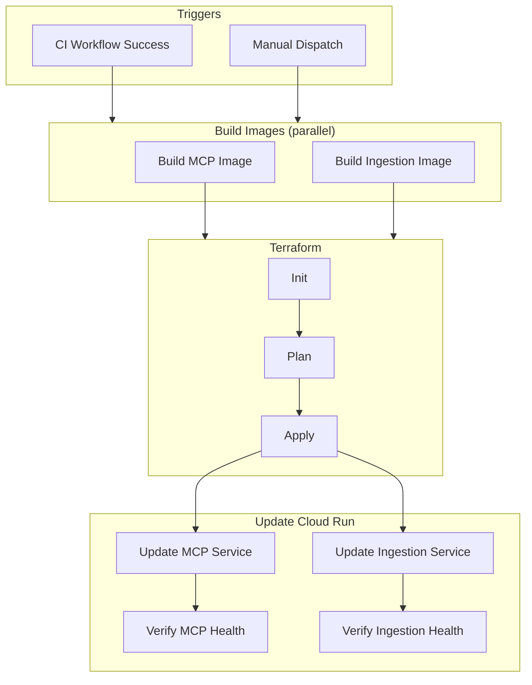
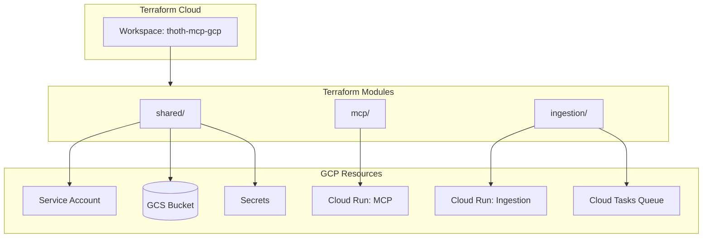
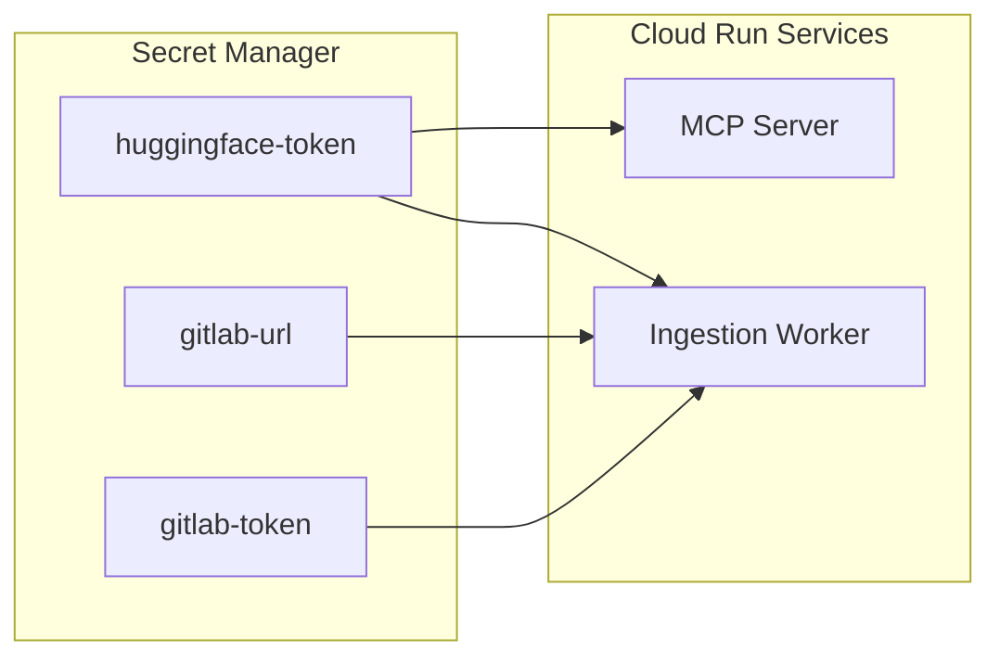
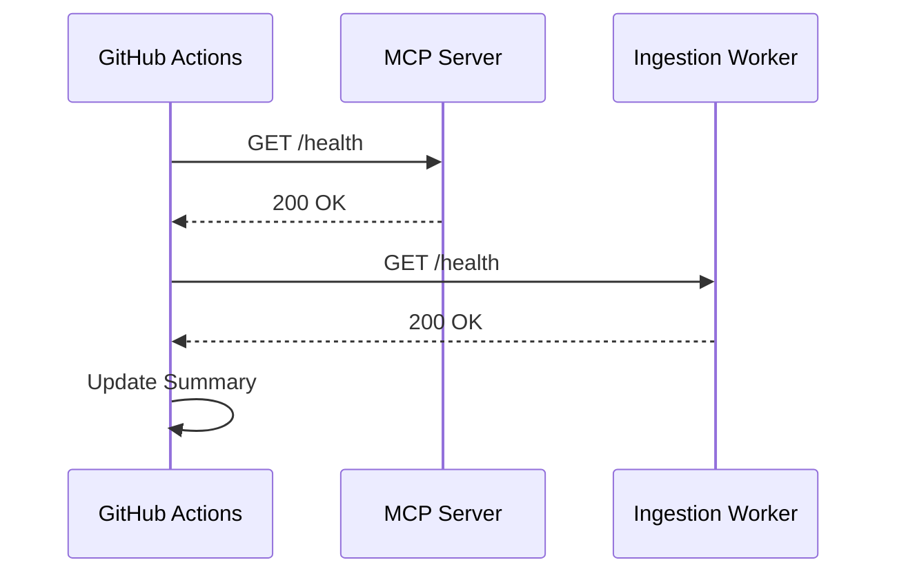

# Deployment Architecture

This document describes the CI/CD pipeline and deployment mechanisms for Thoth.

## Overview

Thoth uses a two-stage deployment pipeline:
1. **CI Workflow**: Lint, type check, test, and build on every push/PR
2. **Infrastructure Workflow**: Deploy to Cloud Run after CI passes on main

## CI/CD Pipeline



## GitHub Actions Workflows

### CI Workflow (`.github/workflows/ci.yml`)

Runs on every push and pull request to main.



**Jobs:**

| Job | Purpose | Dependencies |
|-----|---------|--------------|
| `lint` | Code formatting and linting | None |
| `type-check` | Static type analysis with MyPy | lint |
| `test` | Run pytest across Python versions | type-check |
| `build` | Build wheel and sdist | test |

### Infrastructure Workflow (`.github/workflows/infra-deploy.yml`)

Runs after CI completes on main, or via manual dispatch.



**Jobs:**

| Job | Purpose | Dependencies |
|-----|---------|--------------|
| `build_mcp_image` | Build and push MCP Docker image | None |
| `build_ingestion_image` | Build and push Ingestion Docker image | None |
| `terraform` | Provision infrastructure | build_*_image |
| `update_cloud_run_images` | Deploy new images to Cloud Run | terraform |

## Infrastructure as Code

### Terraform Modules



**Module Structure:**

```
terraform/
├── main.tf                 # Root module, backend config
├── variables.tf            # Global variables
├── environments/
│   └── dev.tfvars          # Dev environment values
├── shared/                 # Shared resources
│   ├── iam.tf              # Service account, IAM
│   ├── variables.tf
│   └── outputs.tf
├── mcp/                    # MCP Server
│   ├── cloud_run.tf
│   ├── variables.tf
│   └── outputs.tf
└── ingestion/              # Ingestion Worker
    ├── cloud_tasks.tf
    ├── ingestion_worker.tf
    ├── variables.tf
    └── outputs.tf
```

## Docker Images

### MCP Server Image (`Dockerfile.mcp`)

```dockerfile
FROM python:3.12-slim
WORKDIR /app
COPY . .
RUN pip install .
EXPOSE 8080
CMD ["python", "-m", "thoth.mcp.http_wrapper"]
```

### Ingestion Worker Image (`Dockerfile.ingestion`)

```dockerfile
FROM python:3.12-slim
WORKDIR /app
COPY . .
RUN pip install .
EXPOSE 8080
CMD ["python", "-m", "thoth.ingestion.worker"]
```

## Cloud Run Configuration

### MCP Server

| Setting | Value | Notes |
|---------|-------|-------|
| CPU | 2 | Allocated vCPUs |
| Memory | 2Gi | For embedder model |
| Min instances | 0 | Scale to zero |
| Max instances | 3 | Cost control |
| Concurrency | 80 | Requests per instance |
| Timeout | 300s | Request timeout |

### Ingestion Worker

| Setting | Value | Notes |
|---------|-------|-------|
| CPU | 1 | Allocated vCPUs |
| Memory | 2Gi | For batch processing |
| Min instances | 0 | Scale to zero |
| Max instances | 10 | Parallel batches |
| Concurrency | 1 | One batch at a time |
| Timeout | 900s | Long-running batches |

## Secrets Management

Secrets are managed via Google Secret Manager:



**GitHub Secrets Required:**

| Secret | Purpose |
|--------|---------|
| `GOOGLE_APPLICATION_CREDENTIALS` | GCP service account JSON |
| `TF_API_TOKEN` | Terraform Cloud API token |

## Deployment Verification

Post-deployment health checks:



## Manual Deployment

### Skip Options

The infrastructure workflow supports skip flags for partial deployments:

```yaml
workflow_dispatch:
  inputs:
    skip_terraform:
      description: "Skip Terraform deployment"
      default: "false"
    skip_cloud_run:
      description: "Skip Cloud Run deployment"
      default: "false"
```

### Rollback

To rollback to a previous version:

```bash
# Get previous image tag
gcloud run revisions list --service=thoth-mcp-server --region=us-central1

# Update to previous revision
gcloud run services update-traffic thoth-mcp-server \
  --to-revisions=REVISION_NAME=100 \
  --region=us-central1
```

## Monitoring

Post-deployment metrics to watch:

| Metric | Source | Alert Threshold |
|--------|--------|-----------------|
| Request latency | Cloud Run | P95 > 2s |
| Error rate | Cloud Run | > 1% |
| Instance count | Cloud Run | > max - 1 |
| Cold starts | Cloud Run | > 10/hour |
