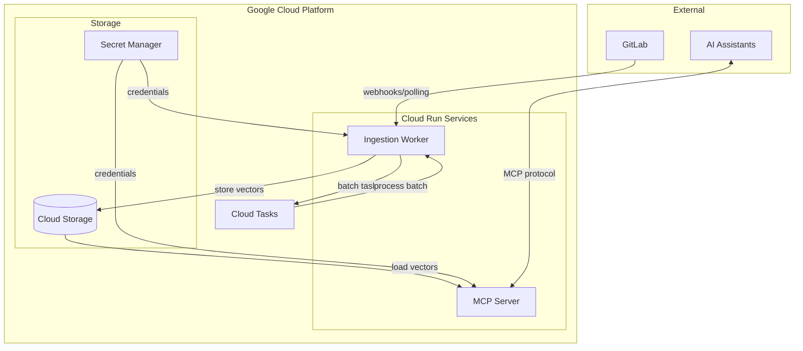

# Architecture Overview

Thoth is a semantic search system for handbook documentation, designed to provide AI assistants with fast, relevant answers from your organization's knowledge base.

## System Components

## Component Responsibilities

| Component | Responsibility |
|-----------|---------------|
| **MCP Server** | Handles semantic search queries from AI assistants via MCP protocol |
| **Ingestion Worker** | Processes markdown files into vector embeddings |
| **Cloud Tasks** | Orchestrates parallel batch processing |
| **Cloud Storage** | Stores raw files and vector database backups |
| **Secret Manager** | Manages API tokens and credentials |

## Data Flow Summary

1. **Ingestion**: GitLab → Chunker → Embedder → LanceDB → GCS (native when using cloud)
2. **Query**: AI Assistant → MCP Server → LanceDB search → Results

## Architecture Documents

- [Ingestion Pipeline](ingestion.md) - Document processing and embedding pipeline
- [MCP Server](mcp-server.md) - Query handling and MCP protocol implementation
- [Deployment](deployment.md) - CI/CD and infrastructure deployment

## Technology Stack

| Layer | Technology |
|-------|------------|
| **Vector Database** | LanceDB |
| **Embeddings** | sentence-transformers (all-MiniLM-L6-v2) |
| **API Protocol** | Model Context Protocol (MCP) |
| **Transport** | HTTP/SSE |
| **Compute** | Google Cloud Run |
| **Storage** | Google Cloud Storage |
| **IaC** | Terraform Cloud |
| **CI/CD** | GitHub Actions |
