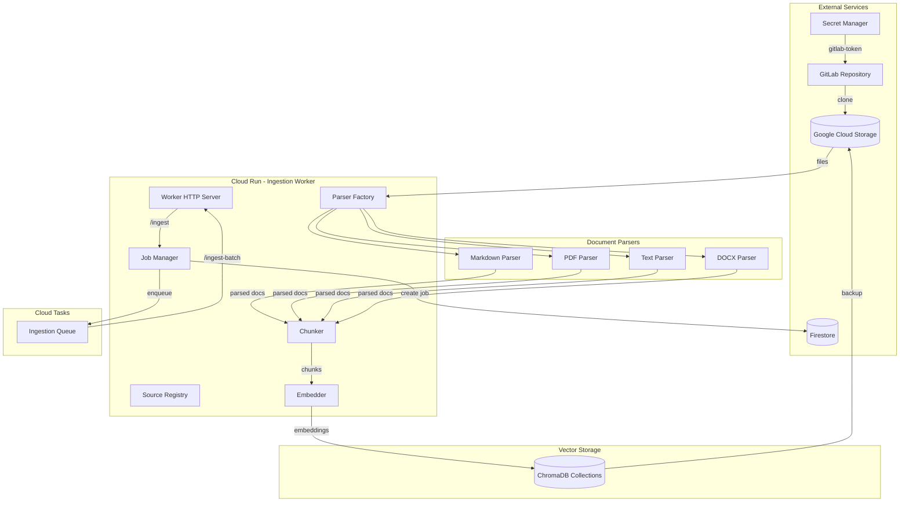
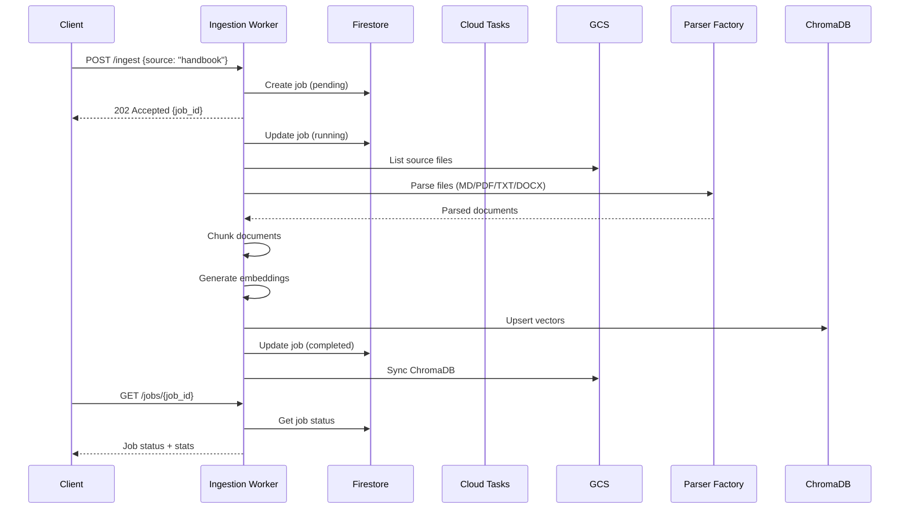
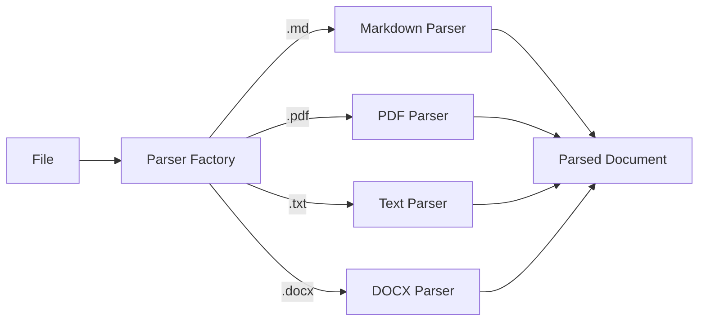
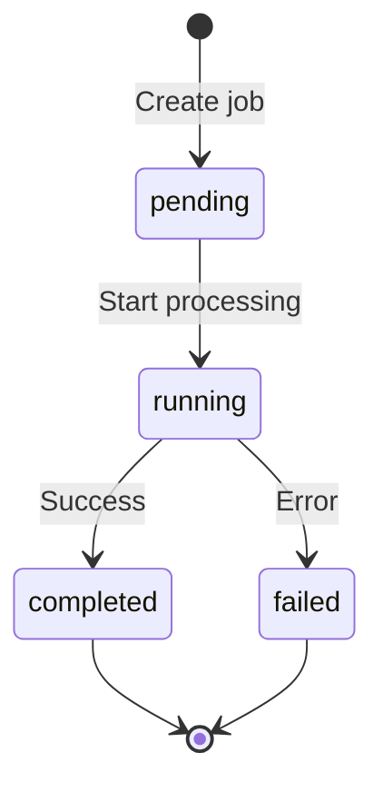
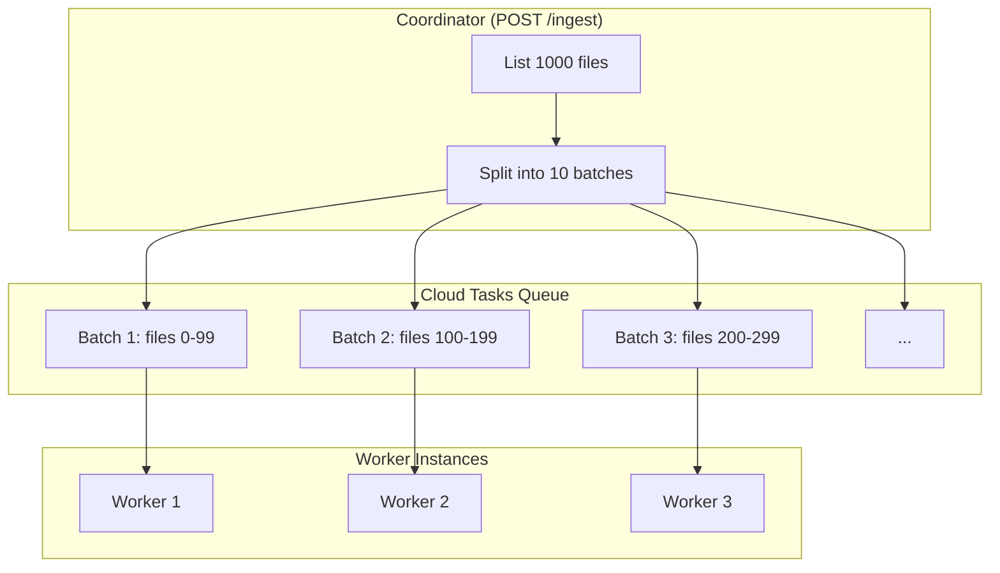

# Ingestion Pipeline Architecture

This document describes the data ingestion pipeline that processes documents from multiple sources into searchable vector embeddings.

## Overview

The ingestion pipeline is responsible for:
1. Managing multiple document sources (handbook, D&D, personal)
2. Parsing multiple file formats (Markdown, PDF, text, Word)
3. Chunking documents into semantic segments
4. Generating embeddings using sentence-transformers
5. Storing vectors in ChromaDB collections for semantic search
6. Tracking job progress via Firestore

## System Architecture



## Data Flow



## Sources

The pipeline supports multiple document sources, each with its own configuration:

| Source | Collection | Formats | Description |
|--------|------------|---------|-------------|
| `handbook` | `handbook_documents` | `.md` | GitLab Handbook |
| `dnd` | `dnd_documents` | `.md`, `.pdf`, `.txt` | D&D materials |
| `personal` | `personal_documents` | `.md`, `.pdf`, `.txt`, `.docx` | Personal documents |

### Source Configuration (`thoth/ingestion/sources/config.py`)

```python
@dataclass
class SourceConfig:
    name: str                    # "handbook", "dnd", "personal"
    collection_name: str         # "handbook_documents"
    gcs_prefix: str              # Where files are stored in GCS
    supported_formats: list[str] # [".md", ".pdf", ".txt", ".docx"]
    description: str
```

## Components

### Document Parsers (`thoth/ingestion/parsers/`)

The parser factory selects the appropriate parser based on file extension:



| Parser | Extensions | Features |
|--------|------------|----------|
| `MarkdownParser` | `.md`, `.markdown`, `.mdown` | YAML frontmatter extraction |
| `PDFParser` | `.pdf` | PyMuPDF text extraction, page numbers |
| `TextParser` | `.txt` | UTF-8/latin-1 encoding support |
| `DocxParser` | `.docx` | Paragraph and table extraction |

### Job Manager (`thoth/ingestion/job_manager.py`)

Tracks ingestion jobs in Firestore:



**Firestore Collection**: `thoth_jobs`

| Field | Type | Description |
|-------|------|-------------|
| `job_id` | string | UUID identifier |
| `status` | enum | pending, running, completed, failed |
| `source` | string | Source name (handbook, dnd, personal) |
| `collection_name` | string | Target ChromaDB collection |
| `started_at` | timestamp | Job start time |
| `completed_at` | timestamp | Job completion time |
| `stats` | object | Processing statistics |
| `error` | string | Error message if failed |

### Document Chunker (`thoth/ingestion/chunker.py`)

Splits documents into semantic chunks:

- **Chunk Size**: 500-1000 tokens (configurable)
- **Overlap**: 50 tokens between chunks
- **Strategy**: Respects markdown structure (headers, code blocks)
- **Metadata**: Preserves file path, section hierarchy, line numbers

### Embedder (`thoth/shared/embedder.py`)

Generates vector embeddings:

- **Model**: `all-MiniLM-L6-v2` (384 dimensions)
- **Batch Processing**: Processes chunks in batches for efficiency
- **Caching**: Model loaded once, reused across requests

### Worker HTTP Server (`thoth/ingestion/worker.py`)

Cloud Run service endpoints:

| Endpoint | Method | Description |
|----------|--------|-------------|
| `/health` | GET | Health check |
| `/clone-handbook` | POST | Clone GitLab handbook to GCS |
| `/ingest` | POST | Start ingestion job (returns job_id) |
| `/ingest-batch` | POST | Process specific file batch |
| `/merge-batches` | POST | Consolidate batch ChromaDBs |
| `/jobs` | GET | List jobs (with filtering) |
| `/jobs/{job_id}` | GET | Get job status |

## API Usage

### Starting an Ingestion Job

```bash
# Start ingestion for a source
curl -X POST https://worker-url/ingest \
  -H "Authorization: Bearer $(gcloud auth print-identity-token)" \
  -H "Content-Type: application/json" \
  -d '{"source": "handbook"}'

# Response
{
  "status": "accepted",
  "job_id": "550e8400-e29b-41d4-a716-446655440000",
  "source": "handbook",
  "collection_name": "handbook_documents",
  "message": "Ingestion job created. Use GET /jobs/{job_id} to check status."
}
```

### Checking Job Status

```bash
curl https://worker-url/jobs/550e8400-e29b-41d4-a716-446655440000 \
  -H "Authorization: Bearer $(gcloud auth print-identity-token)"

# Response
{
  "job_id": "550e8400-e29b-41d4-a716-446655440000",
  "status": "running",
  "source": "handbook",
  "collection_name": "handbook_documents",
  "started_at": "2024-01-15T10:00:00Z",
  "stats": {
    "total_files": 1500,
    "processed_files": 750,
    "failed_files": 2,
    "total_chunks": 3500,
    "total_documents": 3400
  }
}
```

### Listing Jobs

```bash
# List all jobs
curl "https://worker-url/jobs" \
  -H "Authorization: Bearer $(gcloud auth print-identity-token)"

# Filter by source and status
curl "https://worker-url/jobs?source=handbook&status=completed&limit=10" \
  -H "Authorization: Bearer $(gcloud auth print-identity-token)"
```

## Parallel Processing

For large ingestion jobs, the pipeline uses Cloud Tasks for parallel processing:



**Queue Configuration**:
- Max concurrent dispatches: 10
- Dispatch rate: 5 tasks/second
- Retry policy: 3 attempts with exponential backoff (10-60s)

## Configuration

Environment variables:

| Variable | Default | Description |
|----------|---------|-------------|
| `GCP_PROJECT_ID` | - | GCP project for Firestore/GCS |
| `GCS_BUCKET_NAME` | - | GCS bucket for storage |
| `GITLAB_BASE_URL` | `https://gitlab.com` | GitLab instance URL |
| `HANDBOOK_REPO` | - | Repository path (e.g., `group/handbook`) |
| `CHUNK_SIZE` | `800` | Target chunk size in tokens |
| `CHUNK_OVERLAP` | `50` | Overlap between chunks |
| `BATCH_SIZE` | `100` | Files per batch task |
