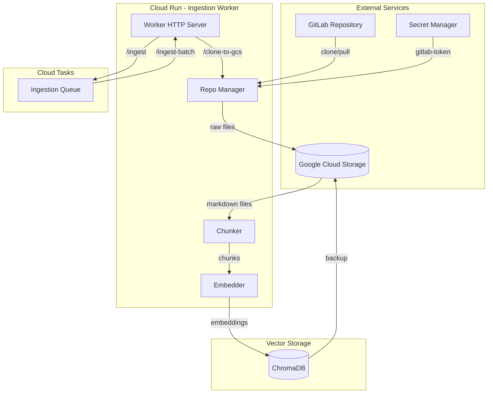
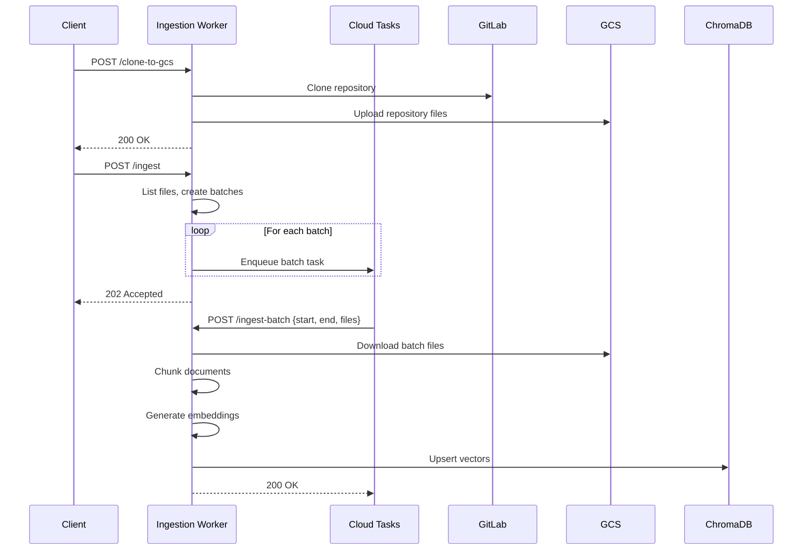
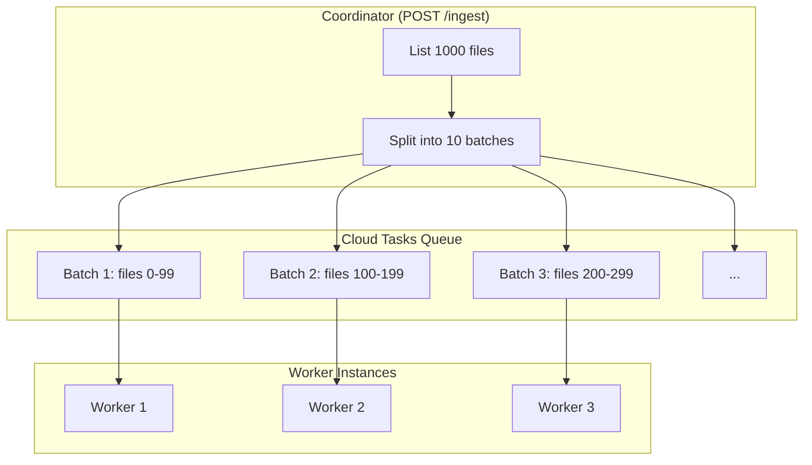

# Ingestion Pipeline Architecture

This document describes the data ingestion pipeline that processes GitLab handbook repositories into searchable vector embeddings.

## Overview

The ingestion pipeline is responsible for:
1. Cloning/syncing GitLab repositories to GCS
2. Chunking markdown documents into semantic segments
3. Generating embeddings using sentence-transformers
4. Storing vectors in ChromaDB for semantic search

## System Architecture



## Data Flow



## Components

### Repository Manager (`thoth/ingestion/repo_manager.py`)

Handles GitLab repository operations:

| Method | Description |
|--------|-------------|
| `clone_handbook()` | Initial clone of handbook repository |
| `update_repository()` | Pull latest changes |
| `get_changed_files()` | Detect files changed since last sync |
| `get_all_markdown_files()` | List all `.md` files in repository |

### Markdown Chunker (`thoth/ingestion/chunker.py`)

Splits documents into semantic chunks:

- **Chunk Size**: 500-1000 tokens (configurable)
- **Overlap**: 50 tokens between chunks
- **Strategy**: Respects markdown structure (headers, code blocks)
- **Metadata**: Preserves file path, section hierarchy, line numbers


### Embedder (`thoth/shared/embedder.py`)

Generates vector embeddings:

- **Model**: `all-MiniLM-L6-v2` (384 dimensions)
- **Batch Processing**: Processes chunks in batches for efficiency
- **Caching**: Model loaded once, reused across requests

### Worker HTTP Server (`thoth/ingestion/worker.py`)

Cloud Run service endpoints:

| Endpoint | Method | Description |
|----------|--------|-------------|
| `/health` | GET/POST | Health check |
| `/clone-to-gcs` | POST | One-time repository clone |
| `/ingest` | POST | Trigger parallel batch ingestion |
| `/ingest-batch` | POST | Process specific file batch |

## Parallel Processing

The pipeline uses Cloud Tasks for parallel processing:



**Queue Configuration**:
- Max concurrent dispatches: 10
- Dispatch rate: 5 tasks/second
- Retry policy: 3 attempts with exponential backoff (10-60s)

## State Management

The pipeline tracks state for resumability:

```python
@dataclass
class PipelineState:
    last_commit: str          # Last processed commit SHA
    processed_files: set      # Files already processed
    failed_files: set         # Files that failed processing
    total_chunks: int         # Total chunks created
    last_run: datetime        # Timestamp of last run
```

State is persisted to GCS for recovery across restarts.

## Configuration

Environment variables:

| Variable | Default | Description |
|----------|---------|-------------|
| `GITLAB_BASE_URL` | `https://gitlab.com` | GitLab instance URL |
| `HANDBOOK_REPO` | - | Repository path (e.g., `group/handbook`) |
| `GCS_BUCKET` | - | GCS bucket for storage |
| `CHUNK_SIZE` | `800` | Target chunk size in tokens |
| `CHUNK_OVERLAP` | `50` | Overlap between chunks |
| `BATCH_SIZE` | `100` | Files per batch task |
