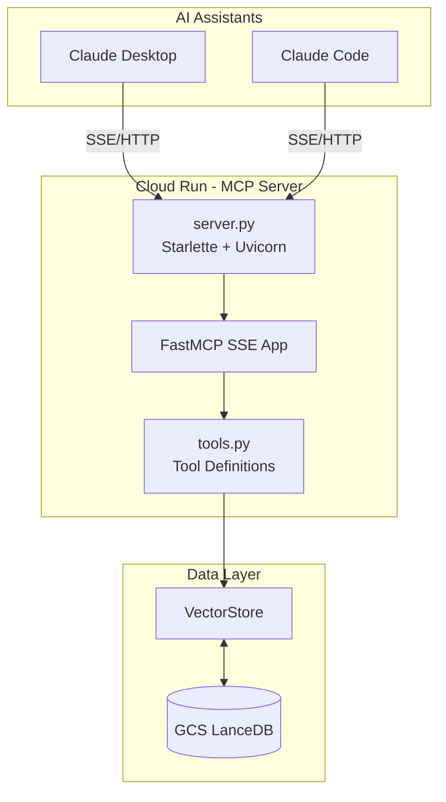
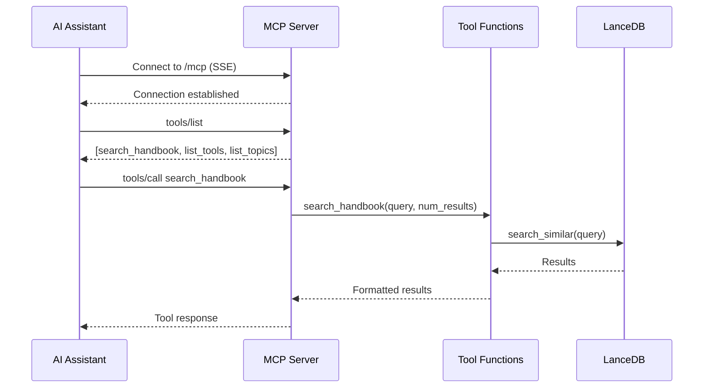

# MCP Server Architecture

This document describes the Model Context Protocol (MCP) server that provides semantic search capabilities over the GitLab Handbook.

## Overview

The MCP server enables AI assistants like Claude to:
1. Search the handbook using natural language queries
2. List available topics and sections
3. Discover available tools

## File Structure

```
thoth/mcp/
├── __init__.py      # Package exports
├── server.py        # HTTP server - handles web traffic & endpoints
└── tools.py         # MCP tools - add new tools here
```

## Components

### Server (`thoth/mcp/server.py`)

Handles HTTP routing and SSE transport:

| Endpoint | Method | Description |
|----------|--------|-------------|
| `/` | GET | Health check |
| `/health` | GET | Health check |
| `/mcp` | GET/POST | MCP SSE endpoint |

### Tools (`thoth/mcp/tools.py`)

Contains all MCP tool definitions using FastMCP decorators.

## Available Tools

### `list_tools`

List all available MCP tools and their descriptions.

**Arguments**: None

**Returns**: Formatted list of available tools

### `list_topics`

List all unique topics/sections available in the handbook collection.

**Arguments**: None

**Returns**: Formatted list of topics with document counts including:
- Total documents
- Total unique files
- Sections sorted by document count

### `search_handbook`

Search the GitLab Handbook for relevant content using semantic search.

**Arguments**:
| Name | Type | Required | Default | Description |
|------|------|----------|---------|-------------|
| `query` | string | Yes | - | Natural language search query |
| `num_results` | integer | No | 5 | Number of results (1-20) |

**Returns**: Formatted search results with:
- Relevance score (similarity)
- Source file path
- Section name
- Document content

## Adding New Tools

To add a new tool, edit `thoth/mcp/tools.py`:

```python
@mcp.tool()
def my_new_tool(param: str, optional_param: int = 10) -> str:
    """Tool description shown to AI assistants.

    Args:
        param: Description of required parameter
        optional_param: Description of optional parameter

    Returns:
        Formatted string result
    """
    # Tool implementation
    return "result"
```

## Architecture Diagram



## MCP Protocol Flow



## Configuration

Environment variables:

| Variable | Required | Description |
|----------|----------|-------------|
| `GCS_BUCKET_NAME` | Yes | GCS bucket containing LanceDB |
| `GCP_PROJECT_ID` | Yes | GCP project ID |
| `PORT` | No | HTTP port (default: 8080) |

## Deployment

The server runs on Cloud Run with:
- Entry point: `python -m thoth.mcp.server`
- Port: 8080
- Health check: `/health`

## Usage Examples

### Connect via Claude Desktop

Add to `claude_desktop_config.json`:

```json
{
  "mcpServers": {
    "thoth-handbook": {
      "url": "https://thoth-mcp-server-XXXXX.run.app/mcp"
    }
  }
}
```

### Test with curl

```bash
# Set variables
export MCP_URL="https://thoth-mcp-server-XXXXX.run.app"
export TOKEN=$(gcloud auth print-identity-token)

# Health check
curl -H "Authorization: Bearer $TOKEN" "$MCP_URL/health"

# Initialize session
curl -X POST -H "Authorization: Bearer $TOKEN" \
  -H "Content-Type: application/json" \
  -H "Accept: application/json, text/event-stream" \
  -d '{"jsonrpc":"2.0","method":"initialize","params":{"protocolVersion":"2025-03-26","capabilities":{},"clientInfo":{"name":"curl","version":"1.0"}},"id":1}' \
  "$MCP_URL/mcp"

# List tools
curl -X POST -H "Authorization: Bearer $TOKEN" \
  -H "Content-Type: application/json" \
  -d '{"jsonrpc":"2.0","method":"tools/list","id":2}' \
  "$MCP_URL/mcp"

# Search handbook
curl -X POST -H "Authorization: Bearer $TOKEN" \
  -H "Content-Type: application/json" \
  -d '{"jsonrpc":"2.0","method":"tools/call","params":{"name":"search_handbook","arguments":{"query":"how to request time off","num_results":3}},"id":3}' \
  "$MCP_URL/mcp"
```
