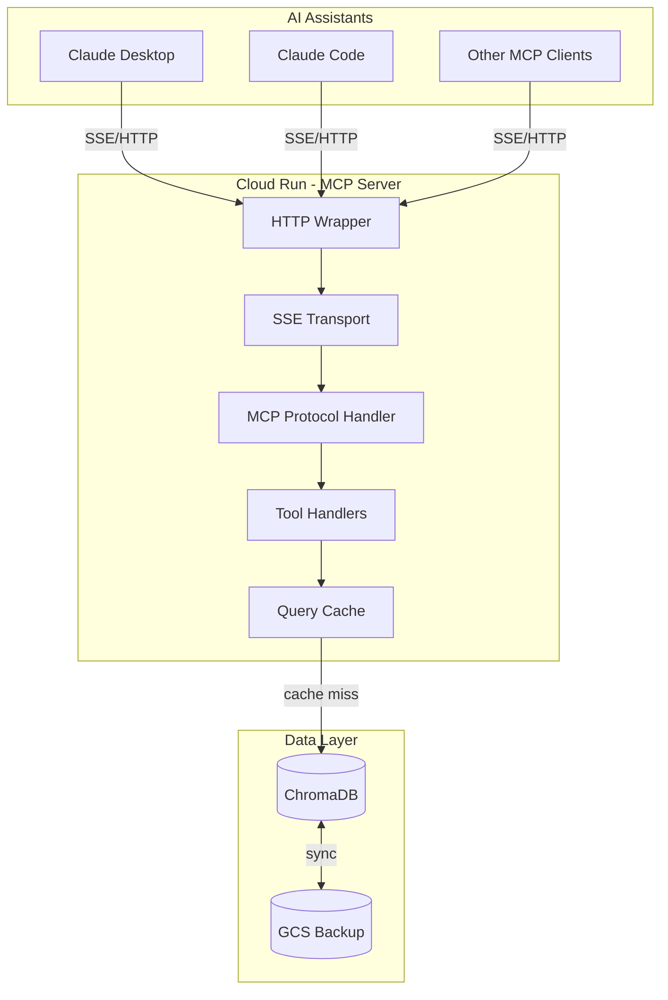
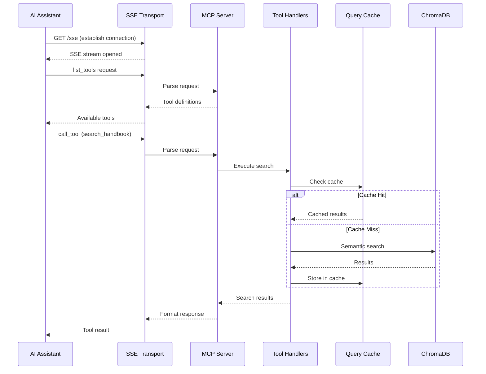
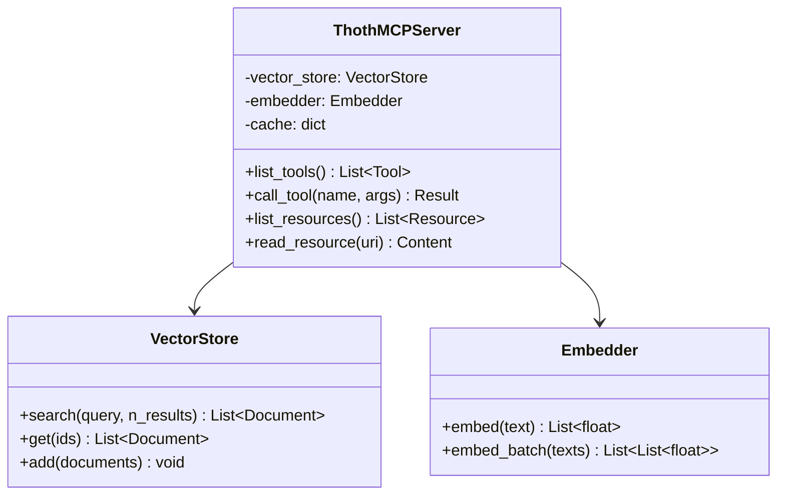
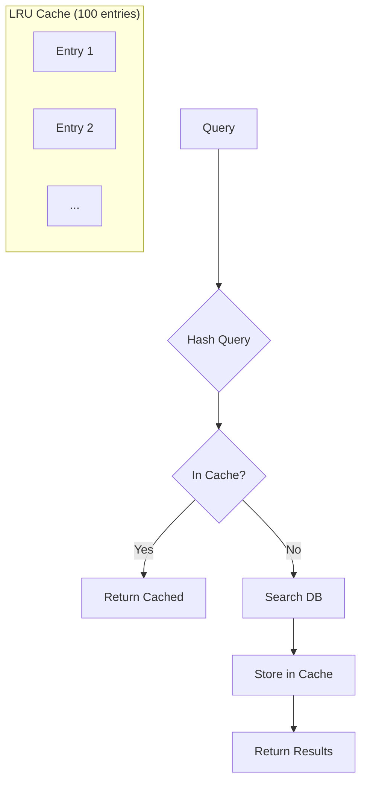
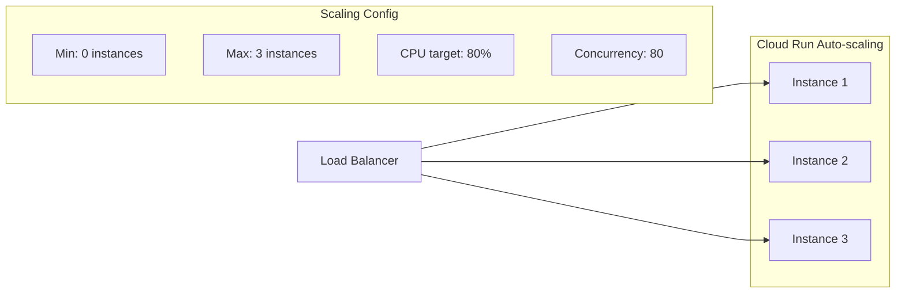
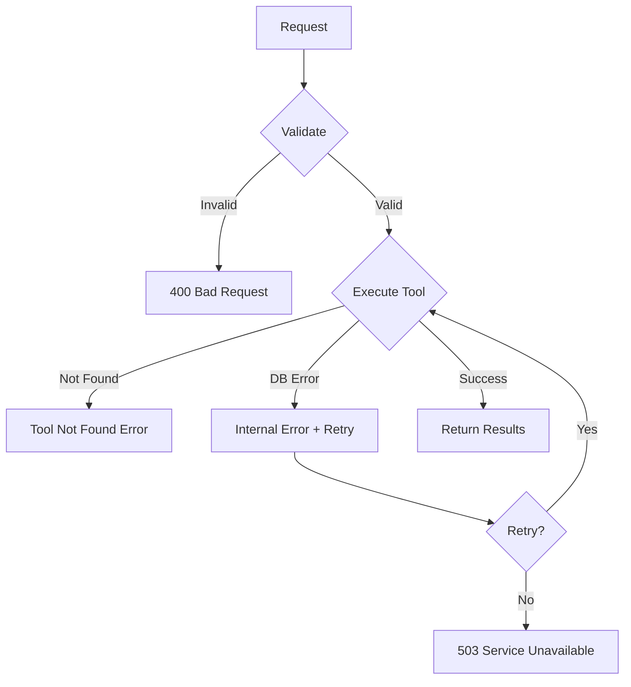

# MCP Server Architecture

This document describes the Model Context Protocol (MCP) server that provides semantic search capabilities to AI assistants.

## Overview

The MCP server enables AI assistants like Claude to:
1. Search handbook documentation using natural language
2. Retrieve specific sections by topic
3. List available handbook topics
4. Get recent documentation updates

## System Architecture

## MCP Protocol Flow

## Components

### HTTP Wrapper (`thoth/mcp/http_wrapper.py`)

Provides HTTP/SSE transport for Cloud Run deployment:

| Endpoint | Method | Description |
|----------|--------|-------------|
| `/` | GET | Root health check |
| `/health` | GET | Detailed health status |
| `/sse` | GET | SSE connection for MCP protocol |
| `/messages` | POST | MCP message handling |

### MCP Server (`thoth/mcp/server/server.py`)

Core MCP protocol implementation:

## Available Tools

### `ping`
Simple connectivity test.

**Arguments**: None

**Returns**: `{"status": "ok", "message": "pong"}`

### `search_handbook`
Semantic search across handbook documentation.

**Arguments**:
| Name | Type | Required | Description |
|------|------|----------|-------------|
| `query` | string | Yes | Natural language search query |
| `section` | string | No | Filter by section (e.g., "engineering") |
| `n_results` | integer | No | Max results (default: 10, max: 20) |

**Returns**: List of matching documents with:
- `content`: Matched text content
- `metadata`: File path, section, relevance score

### `get_handbook_section`
Retrieve a specific section by path.

**Arguments**:
| Name | Type | Required | Description |
|------|------|----------|-------------|
| `path` | string | Yes | Section path (e.g., "engineering/onboarding") |

**Returns**: Full section content with metadata

### `list_handbook_topics`
List all available handbook topics.

**Arguments**: None

**Returns**: Hierarchical list of topics and subtopics

### `get_recent_updates`
Get recently updated documentation.

**Arguments**:
| Name | Type | Required | Description |
|------|------|----------|-------------|
| `days` | integer | No | Lookback period (default: 7) |

**Returns**: List of recently modified documents

## Caching Strategy

**Cache Configuration**:
- Type: LRU (Least Recently Used)
- Max entries: 100
- TTL: Session-based (cleared on restart)
- Hit rate target: ~80% for repeated queries

## Performance Targets

| Metric | Target | Description |
|--------|--------|-------------|
| Response time | < 2s | P95 latency for search queries |
| Cache hit rate | > 80% | For repeated/similar queries |
| Concurrent connections | 50 | Max SSE connections per instance |
| Cold start | < 10s | Time to first request readiness |

## Scaling Configuration

## Error Handling

The server implements graceful error handling:

## Configuration

Environment variables:

| Variable | Default | Description |
|----------|---------|-------------|
| `LOG_LEVEL` | `INFO` | Logging verbosity |
| `CHROMA_PATH` | `/tmp/chroma` | ChromaDB storage path |
| `GCS_BUCKET` | - | GCS bucket for DB sync |
| `CACHE_SIZE` | `100` | Max cache entries |
| `PORT` | `8080` | HTTP server port |
