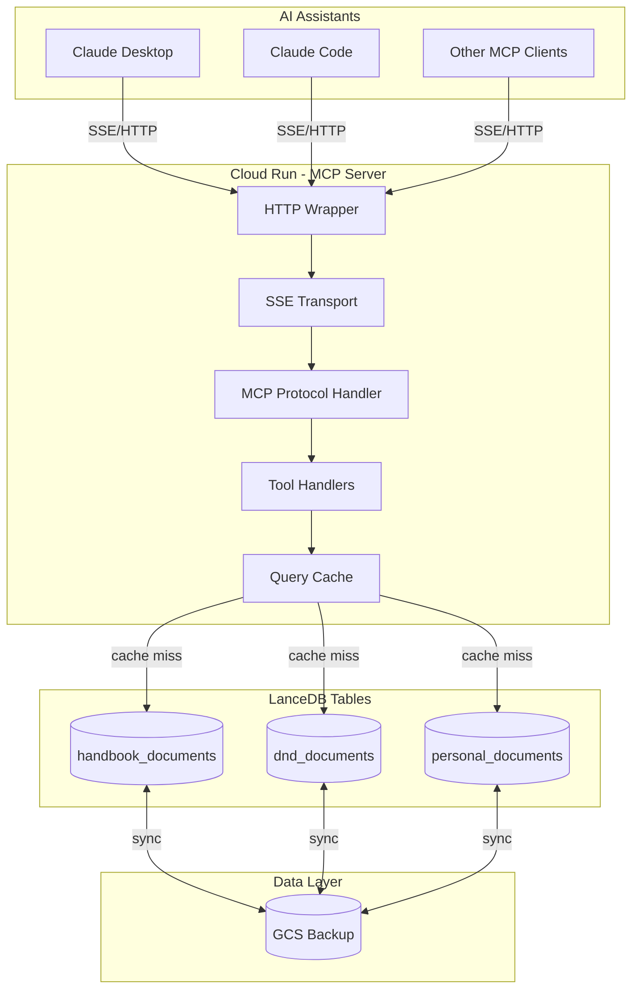
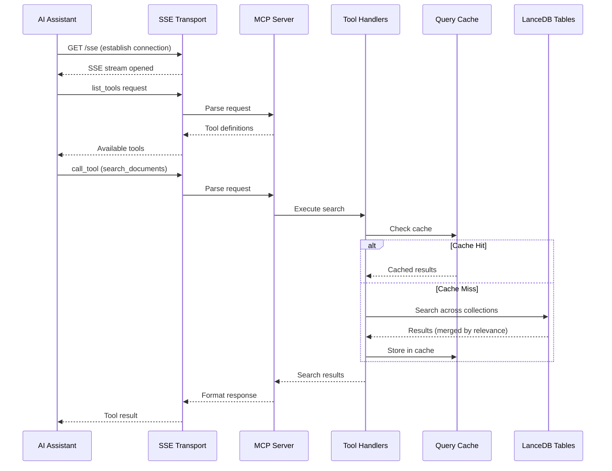
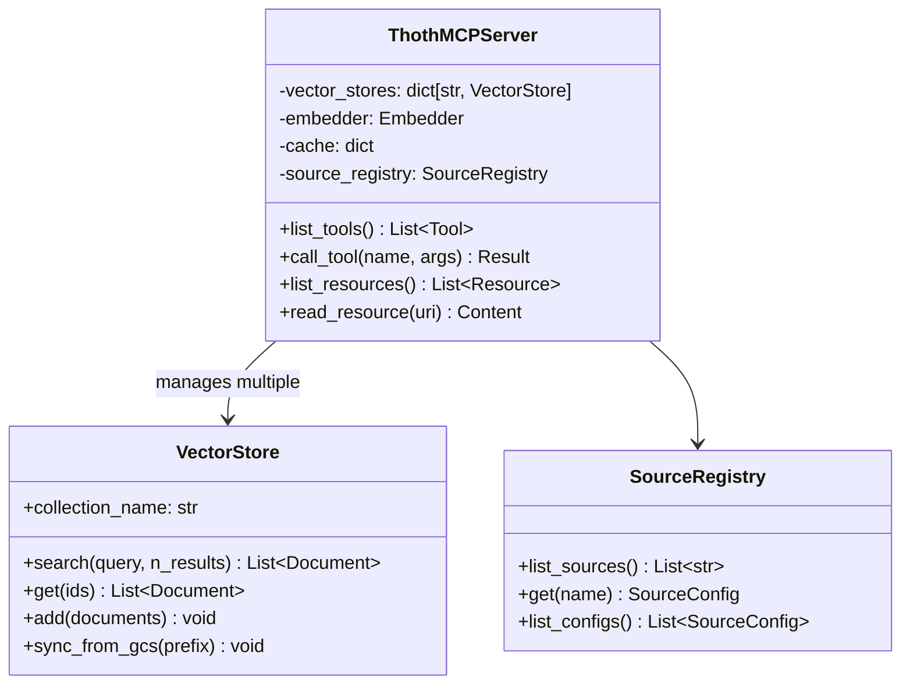
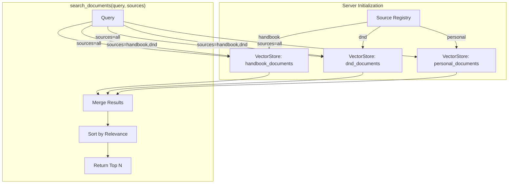
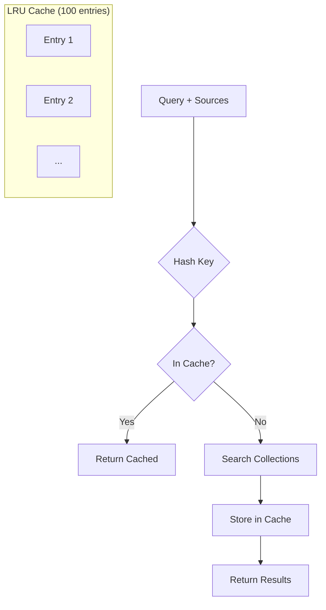
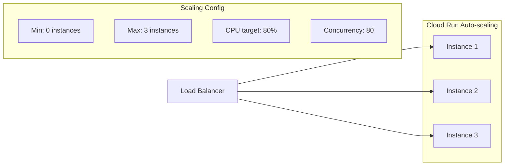
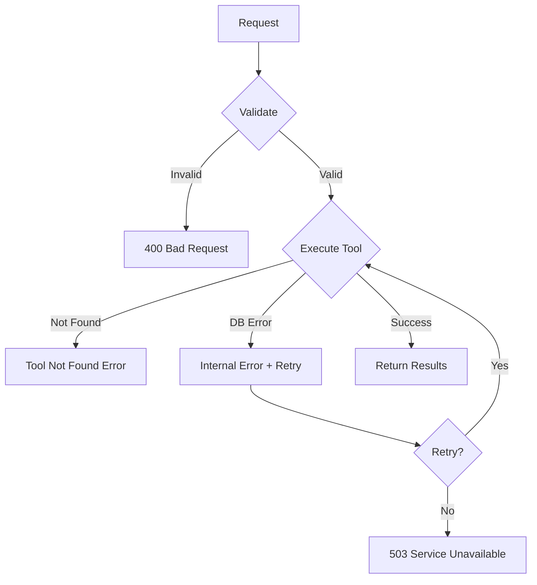

# MCP Server Architecture

This document describes the Model Context Protocol (MCP) server that provides semantic search capabilities to AI assistants across multiple document collections.

## Overview

The MCP server enables AI assistants like Claude to:
1. Search across multiple document collections (handbook, D&D, personal)
2. Filter searches by specific sources
3. Retrieve documents with relevance-based ranking
4. Access cached results for improved performance

## System Architecture



## MCP Protocol Flow



## Components

### HTTP Wrapper (`thoth/mcp/http_wrapper.py`)

Provides HTTP/SSE transport for Cloud Run deployment:

| Endpoint | Method | Description |
|----------|--------|-------------|
| `/` | GET | Root health check |
| `/health` | GET | Detailed health status |
| `/sse` | GET | SSE connection for MCP protocol |
| `/messages` | POST | MCP message handling |

### MCP Server (`thoth/mcp/server/server.py`)

Core MCP protocol implementation with multi-collection support:



## Available Tools

### `ping`
Simple connectivity test.

**Arguments**: None

**Returns**: `{"status": "ok", "message": "pong"}`

### `search_documents`
Search across multiple document collections with optional source filtering.

**Arguments**:
| Name | Type | Required | Description |
|------|------|----------|-------------|
| `query` | string | Yes | Natural language search query |
| `sources` | array | No | Filter by sources (default: all). Options: `handbook`, `dnd`, `personal` |
| `n_results` | integer | No | Max results per source (default: 10, max: 20) |

**Returns**: List of matching documents sorted by relevance with:
- `content`: Matched text content
- `metadata`: File path, source, relevance score
- `source`: Which collection the result came from

**Example**:
```json
{
  "name": "search_documents",
  "arguments": {
    "query": "code review best practices",
    "sources": ["handbook", "personal"],
    "n_results": 5
  }
}
```

### `search_handbook` (Legacy)
Search handbook documentation only. Maintained for backward compatibility.

**Arguments**:
| Name | Type | Required | Description |
|------|------|----------|-------------|
| `query` | string | Yes | Natural language search query |
| `section` | string | No | Filter by section (e.g., "engineering") |
| `n_results` | integer | No | Max results (default: 10, max: 20) |

**Returns**: List of matching documents with:
- `content`: Matched text content
- `metadata`: File path, section, relevance score

## Multi-Collection Search

The server initializes vector stores for all configured sources at startup:



### Search Algorithm

1. **Parse sources**: If not specified, search all available collections
2. **Parallel search**: Query each source's vector store
3. **Merge results**: Combine results from all sources
4. **Sort by relevance**: Order by similarity score (descending)
5. **Deduplicate**: Remove duplicate documents
6. **Limit results**: Return top N results

## Caching Strategy



**Cache Configuration**:
- Type: LRU (Least Recently Used)
- Max entries: 100
- Key: Hash of (query, sources, n_results)
- TTL: Session-based (cleared on restart)
- Hit rate target: ~80% for repeated queries

## Vector Store Initialization

Each collection is synced from GCS at startup:

```python
# GCS prefix pattern for collections
# LanceDB uses single GCS path: gs://bucket/lancedb with one table per collection

# Example prefixes:
# - Tables: thoth_documents, dnd_documents, personal_documents in gs://bucket/lancedb
```

The server handles missing collections gracefully - if a collection doesn't exist in GCS, it's skipped during initialization and searches return empty results for that source.

## Performance Targets

| Metric | Target | Description |
|--------|--------|-------------|
| Response time | < 2s | P95 latency for search queries |
| Cache hit rate | > 80% | For repeated/similar queries |
| Concurrent connections | 50 | Max SSE connections per instance |
| Cold start | < 10s | Time to first request readiness |

## Scaling Configuration



## Error Handling

The server implements graceful error handling:



## Configuration

Environment variables:

| Variable | Default | Description |
|----------|---------|-------------|
| `LOG_LEVEL` | `INFO` | Logging verbosity |
| `base_db_path` | `./vector_dbs` | LanceDB local path or GCS bucket (Cloud Run) |
| `GCS_BUCKET_NAME` | - | GCS bucket for DB sync |
| `GCP_PROJECT_ID` | - | GCP project ID |
| `CACHE_SIZE` | `100` | Max cache entries |
| `PORT` | `8080` | HTTP server port |

## Usage Examples

### Search All Collections

```bash
# Via MCP protocol
{
  "jsonrpc": "2.0",
  "id": 1,
  "method": "tools/call",
  "params": {
    "name": "search_documents",
    "arguments": {
      "query": "how to set up development environment"
    }
  }
}
```

### Search Specific Sources

```bash
# Search only handbook and personal docs
{
  "jsonrpc": "2.0",
  "id": 2,
  "method": "tools/call",
  "params": {
    "name": "search_documents",
    "arguments": {
      "query": "authentication flow",
      "sources": ["handbook", "personal"],
      "n_results": 5
    }
  }
}
```

### Legacy Handbook Search

```bash
# Backward compatible with existing integrations
{
  "jsonrpc": "2.0",
  "id": 3,
  "method": "tools/call",
  "params": {
    "name": "search_handbook",
    "arguments": {
      "query": "onboarding checklist",
      "n_results": 10
    }
  }
}
```
